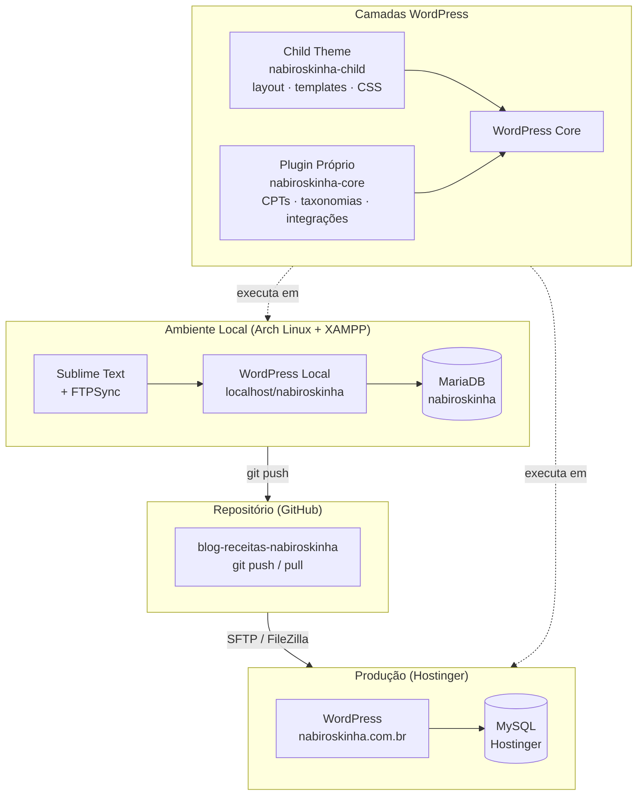

# Nabiroskinha — Blog de Receitas


Blog editorial de receitas caseiras com foco em descoberta orgânica, publicação estruturada e monetização via AdSense. Desenvolvido em WordPress com child theme leve e plugin próprio para lógica de negócio.

---

## Arquitetura



---

## Stack Técnica

| Camada | Tecnologia | Justificativa |
|---|---|---|
| CMS | WordPress (monolítico) | Publicação editorial rápida, custo baixo, ecossistema maduro |
| Hospedagem | Hostinger WordPress gerenciado | Bom custo-benefício + suporte a LiteSpeed e WP-CLI |
| Banco de dados | MySQL / MariaDB | Compatibilidade nativa com WordPress |
| Tema | Child theme (GeneratePress ou Astra) | Performance, flexibilidade e segurança de atualizações |
| Editor | Gutenberg | Evita page builders pesados |
| PHP | 8.2+ | Requisito mínimo do projeto |
| Versionamento | Git + GitHub | Apenas código autoral (tema e plugin próprios) |
| Deploy | SFTP (FileZilla) + FTPSync | Simples, rastreável e suficiente para o MVP |

---

## Stack de Plugins (MVP)

| Plugin | Função |
|---|---|
| WP Recipe Maker | Cadastro estruturado de receitas + schema `Recipe` automático |
| Rank Math SEO | SEO técnico, sitemap, metadados, Open Graph, BreadcrumbList |
| LiteSpeed Cache | Cache de página, CDN e otimização de performance |
| EWWW Image Optimizer | Conversão WebP, compressão e lazy loading |
| Google Site Kit | Integração GA4 e Search Console no painel |
| Advanced Ads | Gerenciamento de posições de anúncios AdSense |
| Complianz | Banner LGPD, cookie consent e Consent Mode GA4 |
| Antispam Bee | Proteção antispam nos comentários (sem envio externo) |
| Wordfence Security | Firewall, scanner de malware e proteção de login |
| UpdraftPlus | Backup automático com destino externo |

> Regra de governança: máximo de 12 plugins ativos. Nenhum plugin instalado fora desta lista sem avaliação prévia.

---

## Estrutura do Repositório

```
nabiroskinha/
├── wordpress694/
│   └── wp-content/
│       ├── themes/
│       │   └── nabiroskinha-child/    # Child theme do projeto
│       └── plugins/
│           └── nabiroskinha-core/     # Plugin próprio do projeto
└── .gitignore
```

> O core do WordPress, plugins de terceiros, uploads e `wp-config.php` **não são versionados**.

---

## Ambiente Local

### Pré-requisitos

- [XAMPP para Linux](https://www.apachefriends.org/) instalado em `/opt/lampp`
- PHP 8.2+ (incluso no XAMPP)
- MariaDB (incluso no XAMPP)

### Setup

```bash
# 1. Clonar o repositório
git clone https://github.com/SEU_USUARIO/blog-receitas-nabiroskinha.git
cd blog-receitas-nabiroskinha

# 2. Criar link simbólico no XAMPP
sudo ln -s /home/$USER/dev/web/nabiroskinha/wordpress694 /opt/lampp/htdocs/nabiroskinha

# 3. Ajustar permissão do home para o Apache
chmod 710 /home/$USER
sudo usermod -aG $USER daemon

# 4. Iniciar o XAMPP
sudo xampp start

# 5. Criar banco de dados
# Acessar http://localhost/phpmyadmin/
# Criar banco: nabiroskinha | collation: utf8mb4_unicode_ci

# 6. Configurar wp-config.php
cp wordpress694/wp-config-sample.php wordpress694/wp-config.php
# Preencher DB_NAME, DB_USER, DB_PASSWORD e Secret Keys
# Gerar Secret Keys em: https://api.wordpress.org/secret-key/1.1/salt/

# 7. Instalar WordPress
# Acessar: http://localhost/nabiroskinha/wp-admin/install.php
```

### Acesso local

| Destino | URL |
|---|---|
| Site | `http://localhost/nabiroskinha/` |
| Admin | `http://localhost/nabiroskinha/wp-admin/` |
| phpMyAdmin | `http://localhost/phpmyadmin/` |

---

## Deploy para Produção

```bash
# 1. Backup obrigatório antes de qualquer deploy
wp db export backup-$(date +%Y%m%d).sql

# 2. Enviar apenas arquivos autorais via SFTP (FileZilla)
# → wp-content/themes/nabiroskinha-child/
# → wp-content/plugins/nabiroskinha-core/

# 3. Migração de banco (primeira vez)
wp db export backup-local.sql
# Upload via SFTP → importar em produção
wp db import backup-local.sql
wp search-replace 'http://localhost/nabiroskinha' 'https://nabiroskinha.com.br' --all-tables

# 4. Limpar cache
wp litespeed-purge all
```

---

## Roadmap MVP — 8 Semanas

| Semana | Foco | Marco |
|---|---|---|
| 1 | Fundação: ambiente, repositório, hospedagem | Ambiente pronto |
| 2 | Estrutura editorial: categorias, template de receita | Modelo editorial fechado |
| 3 | Tema e navegação: homepage, menus, categorias | Site navegável |
| 4 | SEO técnico: sitemap, schema, canonical, breadcrumbs | Base técnica de SEO pronta |
| 5 | Performance e analytics: cache, imagens, GA4 | Site medido e rápido |
| 6 | Conteúdo inicial: receitas, coleção sazonal, links internos | Massa crítica editorial |
| 7 | QA e go-live: validação, Rich Results Test, publicação | Site público |
| 8 | Estabilização: erros, indexação, backlog da fase 2 | MVP estabilizado |

---

## Métricas de Produto (Objetivos MVP)

| Métrica | Meta |
|---|---|
| LCP | < 2,5s |
| CLS | < 0,1 |
| Indexação | Crescimento contínuo via Search Console |
| Sessões orgânicas | Acompanhamento semanal via GA4 |

---

## Segurança e Credenciais

- `wp-config.php` fora do Git — contém credenciais de banco e Secret Keys
- Todas as credenciais (banco, admin, FTP, Hostinger) armazenadas no **KeePassXC**
- Secret Keys geradas via `https://api.wordpress.org/secret-key/1.1/salt/`
- Chaves únicas por ambiente: local e produção têm conjuntos diferentes

---

## Licença

Distribuído sob a licença [GNU General Public License v3.0](LICENSE).

Compatível com a licença do WordPress e seus temas e plugins derivados.
